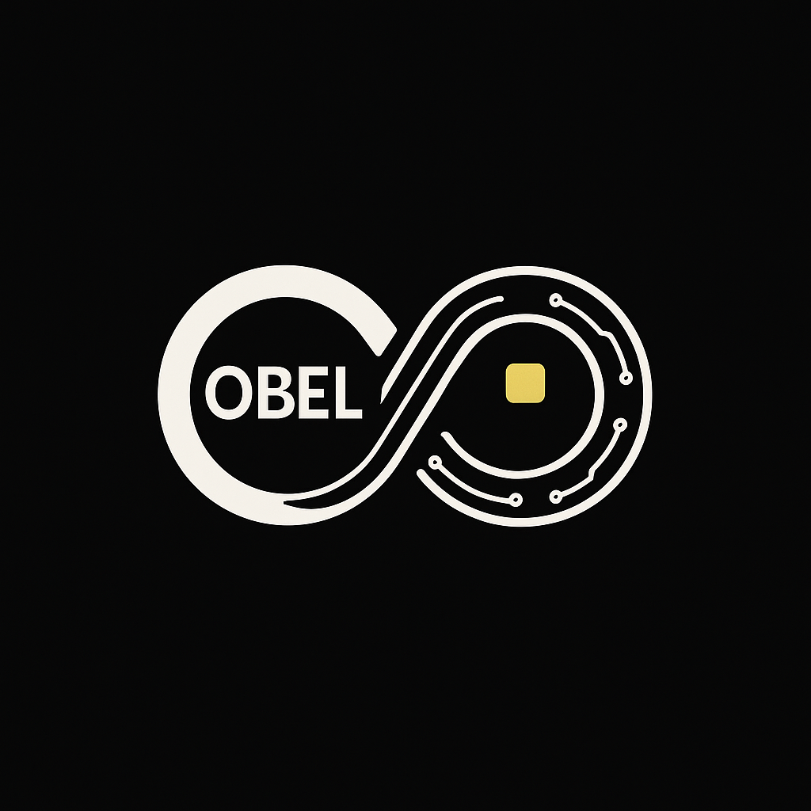

# OBEL — Official Overview

## About OBEL
OBEL is a decentralized digital asset launched on the Solana blockchain, built with a focus on clean branding, locked liquidity, and transparent supply. Designed for the next generation of digital finance, OBEL aims to stand out with simple structure and room to evolve into something bigger — whether as a community-driven asset or a foundation for future payment applications.

## Vision
The vision behind OBEL is to build a recognizable, trusted symbol that starts as a token — and can expand into a wider ecosystem of secure, fast, user-friendly financial tools. Whether it evolves into a payments platform, a peer-to-peer tipping tool, or a bridge between crypto and real-world spending, OBEL’s branding and token structure are built for scale.

## Key Information
- **Name:** OBEL  
- **Symbol:** OBEL  
- **Blockchain:** Solana  
- **Total Supply:** 333,333,333 OBEL (mint permanently disabled)  
- **Liquidity:** Initial supply paired, public, and locked.  
- **Ownership:** Fully visible on-chain, no hidden allocations.

## What Sets OBEL Apart
- 🔒 **Fully Locked Liquidity:** Supply is fixed, minting disabled, and liquidity locked to build trust from day one.  
- ✅ **Community Driven:** No forced promises, no team tokens — growth is organic and shaped by holders.  
- 📈 **Built for Expansion:** Clear branding, simple supply, and on-chain proof make OBEL a potential base for future payments, staking, or utility.

## Repository Contents
This repo includes the official OBEL logo, brand assets, and open on-chain records. Anyone can verify token status and liquidity lock anytime.

## Tagline
> **“OBEL — A foundation for the future of digital money.”**
